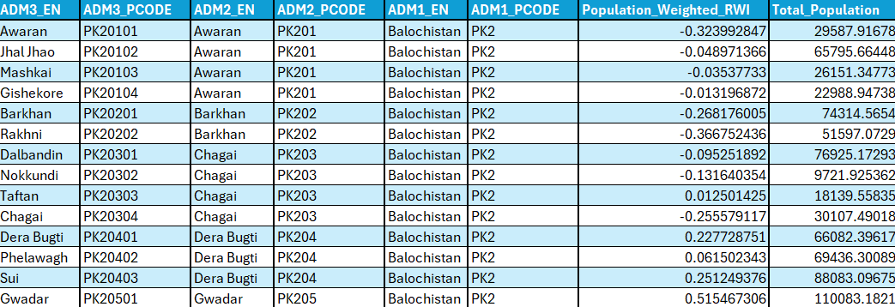

# PAK_geospatial_RWI
This GitHub repository contains data and Jupyter notebooks used by the Poverty and Equity GP's in Pakistan. These notebooks describe the  steps taken to create the population-weighted RWI for Pakistan using GHSL-Population for various administrative levels. All the data used in this code is publicly available.

# Repository Structure
The repository is divided into three folders.

    |-- Input (git-ignored due to the size of the data) 
        |GHSL_PAK_2020 (contains TIF files for SMOD and POP raster for Pakistan for 2020) 
        |admin unit [contains boundary shapefile for Pakistan for each administrative level- the shapefile is clipped to exclude the disputed territory (AJK and GB)].
        |CSV file containing The Relative Wealth Index for India and Pakistan
    |-- Output
        |RWI_Raster (contain the Raster of RWI)
        |Population weighted RWI (contains CSV files which sum up the population-weighted RWI for districts and tehsil)
    |-- Code (Two Python scripts)

# Environment Setup
This work was done using Python 3.11.9. The repository contains a *txt* file listing all the Python libraries referenced and how to call them on 2024_Geospatial Anaconda Environment Setup. Setting up the enviroment and installing the necessary libraries is the first thing to do! 

# Data Overview

1. The source for shapefiles with Pakistan administrative boundaries is the Common Operational Datasets 2022 from UNOCHA [humdata](https://data.humdata.org/dataset/cod-ab-pak?). It has four administrative levels (ADM1 to ADM4)

2. GHS-POP is a dataset that merges satellite-derived information on built-up areas with census data to estimate the number of people worldwide. Grid cells with more built-up areas are assumed to have higher population densities. The data was downloaded from the website at 1km resolution and MollWeide Projection. The data was downloaded for the year 2020 and clipped for Pakistan [GHS Pop](https://ghsl.jrc.ec.europa.eu/download.php?ds=pop).

3. The Relative Wealth Index predicts the relative standard of living within countries using de-identified connectivity data, satellite imagery and other nontraditional data sources. The data is provided for 93 low and middle-income countries at 2.4km resolution [RWI](https://data.humdata.org/dataset/relative-wealth-index?).

# Running the code
Pull the repository to obtain the same folder structure to run the code. The repository has 3 folders: Input, Output and Code.

The *Code* folder has two notebooks, which should be run in order: 

    1. GEOTIFF.ipynb: It contains the code to: 

* a) Turn the RWI CSV into a GeoTIFF
* b) Clip the Raster to Pakistan as the data initially is for Pakistan and India (saves processing time).
* c) Resample and reproject the raster to fit the projection and resolution of the GHS-POP.
The outputs of this notebook are located in the subfolder of the *Output folder* called *RWI_Raster*. 
    a. The RWI raster for Pakistan and India,
    b. The RWI raster for Pakistan after clipping,
    c. The final RWI which has been resampled and reprojected (the one we use)

    2. Population weighted RWI: Uses the GHS Population Raster of Pakistan to calculate population-weighted RWI. Its output are two CSV files with the pop-weighted RWI for each district and tehsil. They are located in the subfolder of the *Output folder* called *.Output/population_weighted_rwi*. 

# Important Note

If you duplicate these codes for a different country, you need to change the shapefiles in the admin units folder with the ones you require and adjust code accordingly. 

```
a.Change the "pak_admbnda_adm2_wfp_20220909.shp" to the name of your shapefile in 
    i.  districts_shapefile_path = os.path.join(input_dir, "admin units", "pak_admbnda_adm2_wfp_20220909.shp") 
    ii. tehsil_shapefile_path = os.path.join(input_dir, "admin units", "pak_admbnda_adm3_wfp_20220909.shp")

b. Take notice of the labels of the administrative levels and revise accordingly.
```


# CSV OUTPUTS




| Name       | Description   |
| --------  | ------- |
| ADM3_PCODE   |  P-codes for each tehsil in Pakistan in 2022	| Unique identifier
| ADM3_EN   |  Name of each tehsil in Pakistan in 2022	|
| ADM2_PCODE   |  P-codes for district that the tehsil is in	|
| ADM3_EN     |  Name of each district that the tehsil is in  |
| ADM1_PCODE   |  P-codes for province that the tehsil is in	|
| ADM1_EN   |  Name of province that the tehsil is in	|
| Total Population     | Total population in the tehsil  |
| Population_Weighted_RWI     | pop_weighted RWI of each tehsil  |
